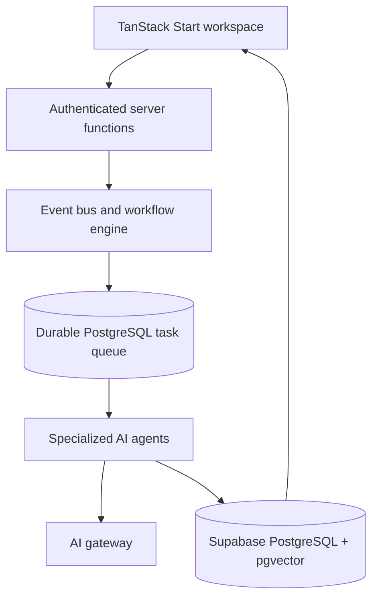

# Aether OS — Career Engine AI

An event-driven career workflow workspace that explores durable AI-agent
orchestration, explainable decisions, job discovery, application preparation,
and approval-gated outreach.

> **Status:** Active beta. Core workflows and operator surfaces are implemented,
> while production integrations and autonomous scheduling remain intentionally
> limited. See [Known limitations](#known-limitations).

## What it demonstrates

- TanStack Start, React 19, TypeScript, and server functions
- Supabase PostgreSQL with row-level security and pgvector-backed memory
- Durable database task queue, retries, dead-letter handling, and audit history
- Specialized AI agents coordinated through an event-driven workflow engine
- Human approval gates for applications, outreach, and follow-ups
- Admin, observability, launch-readiness, and feedback surfaces
- Vercel deployment configuration and scheduled workflow hooks

## Architecture



The execution model uses stateless workers and database-backed state. Events,
queued work, workflow transitions, agent runs, decisions, and audit records are
persisted so failures can be retried or inspected instead of disappearing in
memory. Read the detailed [architecture notes](./ARCHITECTURE.md).

## Safety model

- External applications, outreach, and follow-ups are approval-gated.
- Per-row Supabase RLS scopes user-owned data.
- Daily caps, excluded companies, quiet hours, and confidence thresholds limit
  automated behavior.
- A global pause control returns automation to manual mode.
- AI decisions record rationale and confidence for operator review.

## Local development

Prerequisites: Node.js 22+ and a configured Supabase project.

```bash
npm install
cp .env.example .env
npm run dev
```

Never commit `.env` or production credentials. Use `.env.example` only as a
variable-name reference.

## Validation

```bash
npm run lint
npm run build
```

## Deployment

The repository includes Vercel configuration and a deployment runbook covering
Supabase migrations, Google OAuth, Resend, environment variables, cron behavior,
and smoke testing. See [DEPLOY.md](./DEPLOY.md).

## Known limitations

- Autonomous application submission is disabled by design.
- Gmail and external-send integrations require production OAuth and provider
  configuration before use.
- Workday, Ashby, RSS, and general careers-page intake remain manual.
- Agent-memory recall is not yet included in strategist prompts.
- The scheduled workflow tick must be verified after production deployment.

These limitations are kept explicit so the repository accurately represents an
active beta rather than a finished production service.
